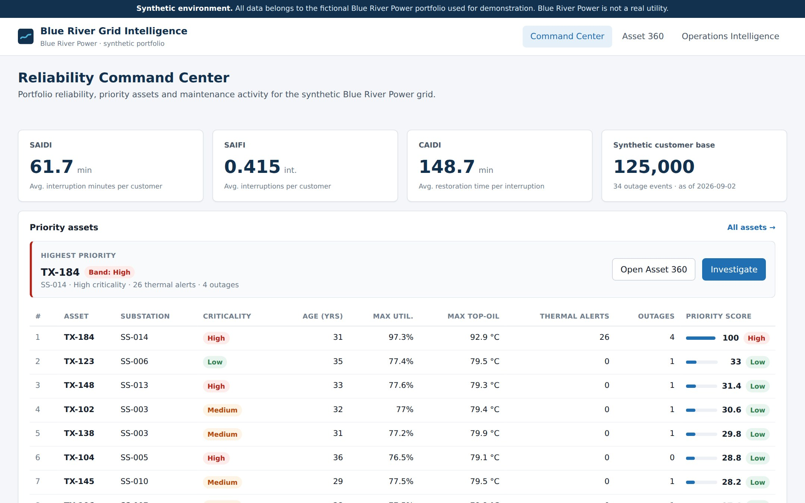
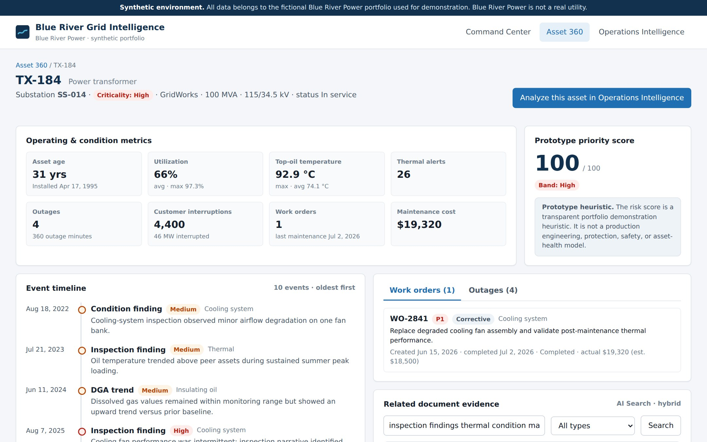
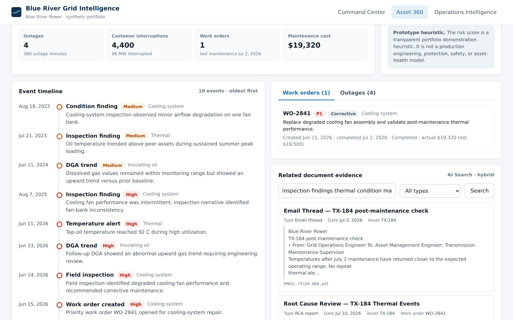
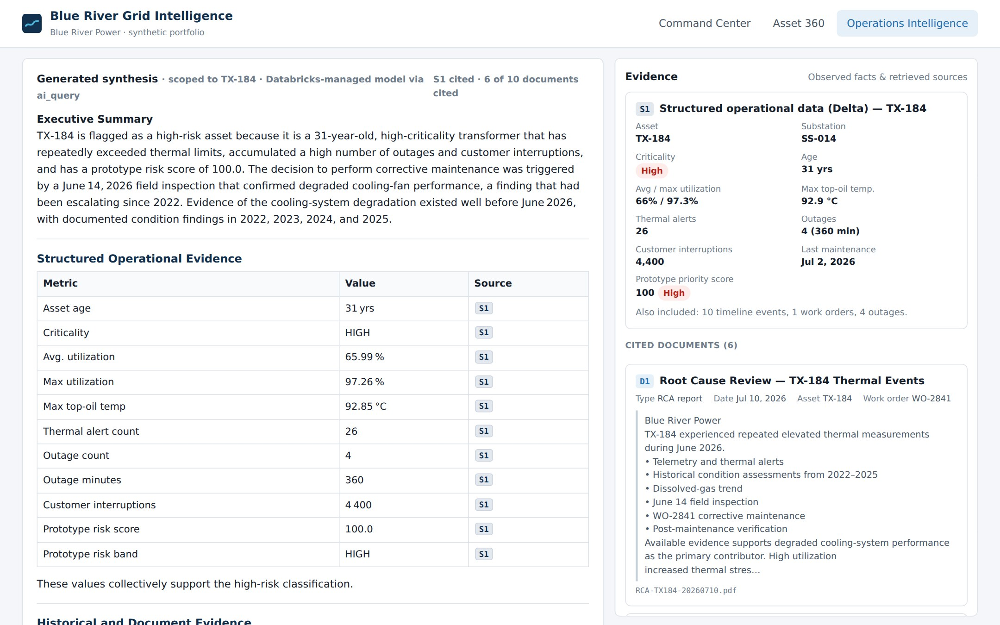
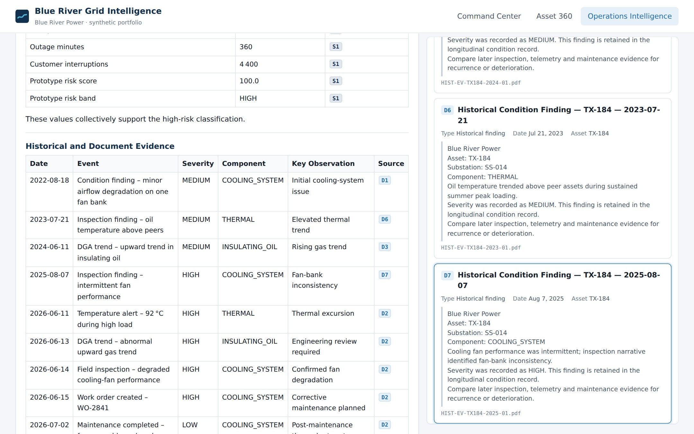
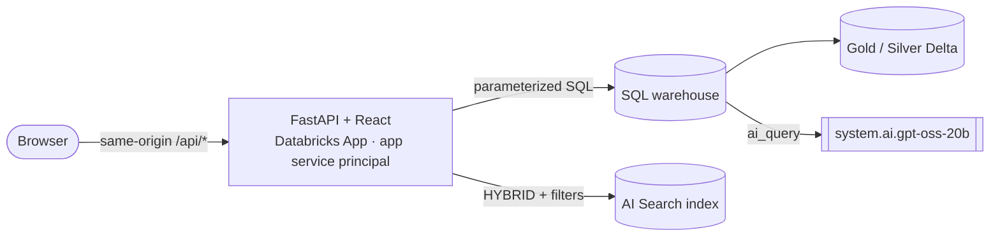

# Blue River Grid Intelligence

An operational intelligence application for a **synthetic** electric utility, built as a single Databricks App. Reliability engineers can:
- move from portfolio KPIs to one asset's condition history;
- investigate operational questions in natural language with grounded AI analysis;
- get answers in which every number traces to a governed Delta table and every documentary claim traces to a retrieved, cited source.

It is Stage 4, the application layer, of the **Blue River Power — Utility Grid Reliability & AI Intelligence Platform**:

| Stage | What it built |
|---|---|
| 1 | Synthetic source world: assets, telemetry, outages, work orders and enterprise-style PDFs |
| 2 | Lakeflow Bronze/Silver/Gold pipeline; `ai_parse_document` → chunks → Databricks AI Search (HYBRID) |
| 3 | Validated hybrid RAG: Delta facts `[S1]` + document evidence `[D#]` → `system.ai` model → citation checks |
| **4** | **This repository:** React + FastAPI Databricks App over the frozen Stage 1–3 backend |

> **Repository scope.** This repository contains the Blue River Grid Intelligence application layer (Stage 4), plus selected architecture, validation and design artifacts. The underlying Databricks lakehouse, AI Search and hybrid-RAG foundation from Stages 1–3 was implemented separately. Its full notebook and source implementation is not included in this repository.

> **Synthetic data.** Blue River Power is fictional, and all data is generated. The asset "risk score" is a transparent demonstration heuristic, **not** an engineering, protection, safety or asset-health model. The app says so on every screen where it appears.

## Modules

| Module | What it does |
|---|---|
| **Command Center** | Portfolio reliability (SAIDI, SAIFI, CAIDI), priority assets and maintenance activity |
| **Asset 360** | One asset's condition metrics, event timeline, work orders, outages and related document evidence |
| **Operations Intelligence** | Combines structured operational data with retrieved utility documents to provide grounded, source-linked explanations and investigation support: structured operational evidence `[S1]` plus document retrieval `[D#]`, using hybrid RAG with a Databricks-managed model via `ai_query` |

## What this demonstrates

- **An LLM that summarizes but never computes.**
  - Reliability KPIs, asset metrics, timelines and work orders come from parameterized SQL against Delta.
  - Documentary evidence comes from HYBRID retrieval on Databricks AI Search.
  - A Databricks-managed model (`system.ai.gpt-oss-20b` via `ai_query`) only synthesizes the evidence it's given.
- **Verified citations.** Every `[D#]` label maps to a server-side source manifest, and each answer is re-checked before it reaches the UI: structured citation present, at least two documents, no invented labels. Any failure shows up as a visible warning.
- **Evidence-first UX.** Each citation is a clickable chip that opens its source: title, type, date, asset, work order and excerpt. Documents the model saw but didn't cite are listed too.
- **Least-privilege platform integration.**
  - One same-origin app runs as its own service principal.
  - Resources are bound through `app.yaml` `valueFrom`.
  - The service principal has SELECT on exactly six tables plus the index.
  - There are no secrets. No tokens or internal storage paths reach the browser or the model, and automated leak scans enforce this.
- **Reuse, not rebuild.** The app adds no new index, serving endpoint or pipeline. It consumes the Stage 3 pattern and ports its prompt and checks faithfully.

## Application showcase

**Reliability Command Center.** SAIDI 61.7 min, SAIFI 0.415 and CAIDI 148.7 min across a synthetic base of 125,000 customers. TX-184 leads the priority list with a score of 100 (next highest: 33), 26 thermal alerts and 4 outages.



**Asset 360 — TX-184.** Condition metrics and the prototype score with its disclaimer. The timeline runs from a minor cooling finding in 2022 to the June 2026 alert → inspection → WO-2841 corrective maintenance cascade. Related documents come from a live HYBRID search filtered to the asset.





**Operations Intelligence.** The flagship question — *why is TX-184 high risk, what led to the corrective maintenance decision, and was there earlier evidence?* — answered with structured facts `[S1]` and ten retrieved documents. The header shows how many sources the answer cited.



**Citation drill-down.** Clicking a document chip highlights its source in the evidence panel — here `D7`, the 2025 historical condition finding.



## Architecture



The Operations Intelligence request flow:

```
question → validate/resolve asset → [Delta facts → S1]  ∥  [AI Search HYBRID: asset k=8 + POLICY k=4 → D1…D10]
         → grounded prompt (Stage 3 rules) → ai_query → citation normalization + validation → answer + source manifest
```

Full write-up covering identity and grants, API, safety, the RAG flow and testing: **[docs/architecture.md](docs/architecture.md)**.

## Validation

| | Result |
|---|---|
| Deployed acceptance suite, run **as the app's service principal** | 25 / 25 |
| Stage 3 retrieval regression (R1–R4) | 4 / 4 |
| Flagship grounding checks (`[S1]`, ≥2 docs, no unknown labels) | pass |
| Backend unit tests / frontend tests | 24 / 8 passing |

Details: [docs/validation-results.md](docs/validation-results.md).

## Tech stack

Databricks Apps · Unity Catalog · Databricks SQL (Statement Execution API) · Databricks AI Search / Vector Search (HYBRID) · `ai_query` + `system.ai.gpt-oss-20b` · FastAPI · Databricks SDK for Python · React 19 + TypeScript · Vite · TanStack Query · React Router · react-markdown · pytest · Vitest + Testing Library · Playwright (screenshots).

## Repository layout

```
backend/            FastAPI app: routers, services (reliability, assets, knowledge, operations_intelligence), SQL catalogue
frontend/           React + TypeScript UI (built into backend/static at deploy time)
scripts/            build · stage · create_app · deploy · grants.sql · smoke.py · capture_screenshots.py
docs/               architecture, validation results, release notes, design contracts, screenshots
app.yaml            Databricks App runtime: uvicorn command + resource env via valueFrom
```

## Running it

This app needs the Blue River Power Stage 1–3 backend in a Databricks workspace (Free Edition works). Local development, testing and deployment are covered in **[docs/development.md](docs/development.md)**. In short:

```bash
scripts/create_app.sh        # one-time: app + service principal + resource bindings
# apply scripts/grants.sql for the printed service principal
scripts/deploy.sh            # build → stage → upload → apps deploy
python3 scripts/smoke.py --app
```

## License

MIT. See [LICENSE](LICENSE).
