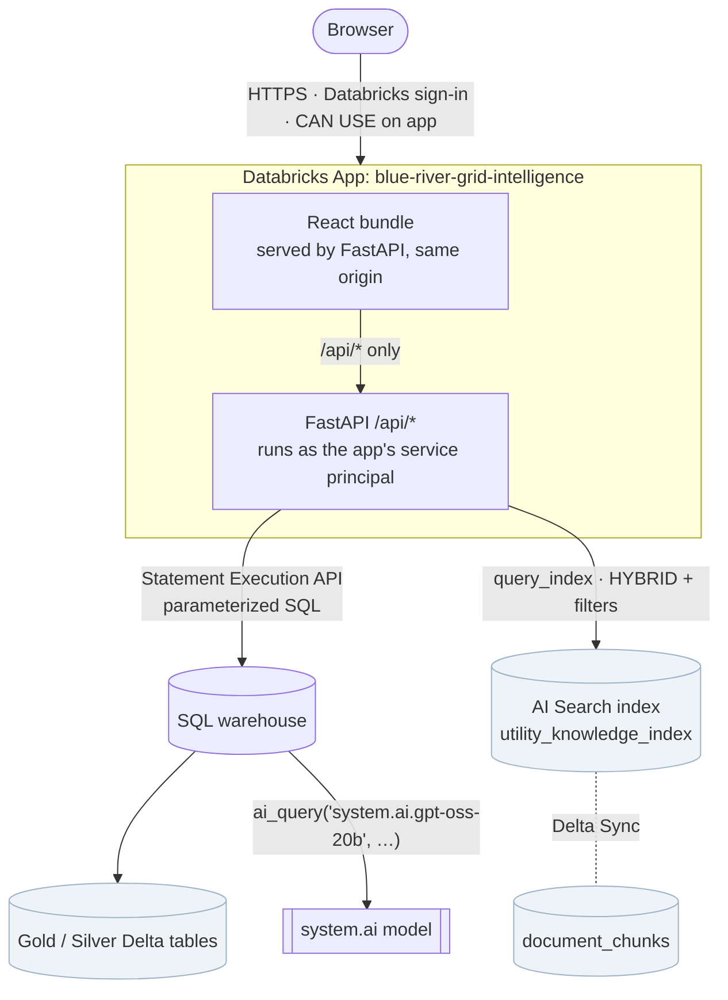

# Architecture — Blue River Grid Intelligence

Blue River Grid Intelligence is Stage 4 of the **Blue River Power — Utility Grid Reliability & AI Intelligence Platform**. The earlier stages built the data platform:

- **Stage 1:** a synthetic source world.
- **Stage 2:** a Lakeflow medallion pipeline and Databricks AI Search.
- **Stage 3:** a validated hybrid-RAG pattern.

Stage 4 is the application layer on top: one Databricks App with a FastAPI backend and a React frontend. It consumes the frozen Stage 1–3 backend and does not rebuild it.

> All data belongs to the fictional Blue River Power utility. Blue River Power is not a real utility, and the prototype risk score is a demonstration heuristic, not an engineering or safety model.

---

## 1. System view



The browser never talks to Databricks services directly. It receives no tokens, workspace URLs or resource IDs. Only the FastAPI process calls the warehouse, AI Search and the model, and it does so as the app's own service principal.

## 2. What was frozen, and what Stage 4 adds

| Layer | Owner | Stage 4 changes |
|---|---|---|
| Synthetic source world, S3 landing | Stage 1 | none |
| Lakeflow Bronze / Silver / Gold | Stage 2 | none |
| `ai_parse_document` → `document_chunks` → AI Search index (HYBRID) | Stage 2 | none: the existing index is reused |
| Hybrid context `[S1]` + `[D#]`, grounded prompt, `ai_query`, citation checks | Stage 3 | ported into the backend as a service (§5) |
| Databricks App, API, UI | **Stage 4** | new |

Stage 4 creates no pipelines, tables, search indexes, serving endpoints or secrets. It adds one Databricks object, the app, together with the service principal Databricks creates for it.

## 3. Identity, resources and least privilege

**Two separate authorization questions:**
1. *Can this person open the app?* Databricks signs the user in and checks CAN USE on the app.
2. *What can the app itself read?* Data access uses the app's dedicated service principal, so every viewer sees the same synthetic portfolio. On-behalf-of-user access is a deliberate future option; it is not part of v1.

**Resource bindings.** Values reach the code through `app.yaml` `valueFrom`, so nothing is hardcoded:

| Resource key | Bound object | Permission | Environment variable |
|---|---|---|---|
| `sql-warehouse` | existing serverless SQL warehouse | CAN USE | `DATABRICKS_WAREHOUSE_ID` |
| `vector-search-index` | `workspace.brp_knowledge.utility_knowledge_index` | SELECT | `DATABRICKS_AI_SEARCH_INDEX` |

**Unity Catalog grants.** These are read-only ([`scripts/grants.sql`](../scripts/grants.sql)): `USE CATALOG workspace`, `USE SCHEMA` on `brp_gold` and `brp_silver`, and `SELECT` on exactly six tables:

- `workspace.brp_gold.asset_operational_summary`
- `workspace.brp_gold.asset_event_timeline`
- `workspace.brp_gold.reliability_kpis`
- `workspace.brp_gold.maintenance_summary`
- `workspace.brp_silver.outage_events`
- `workspace.brp_silver.work_orders`

There are no MODIFY, CREATE or OWN grants, and nothing is granted at schema level. The model (`system.ai.gpt-oss-20b`) worked through `ai_query` with default access, so no `system.ai` grants were needed.

**Credentials.** The backend uses `WorkspaceClient()` with Databricks unified authentication. There are no PATs, client secrets or `.env` files in the deployment.

## 4. Backend

```
backend/
  main.py            FastAPI app, error mapping, static bundle + SPA fallback
  config.py          resource env vars (valueFrom), disclaimer text, lazy WorkspaceClient
  errors.py          typed errors → clean JSON {error:{code,message}}
  db/sql.py          Statement Execution wrapper: bound params, polling, timeout+cancel, 2 in-flight max
  db/queries.py      every SQL statement the app can run (server-defined, :named params only)
  services/          reliability, assets, knowledge (AI Search), asset_resolver, prompt, citations, operations_intelligence
  routers/           health, data (deterministic), ai (search + operations intelligence)
```

**API**

| Route | Purpose | LLM? |
|---|---|---|
| `GET /api/health` | readiness check, no warehouse or AI calls | no |
| `GET /api/reliability` | SAIDI / SAIFI / CAIDI, synthetic customer base | no |
| `GET /api/operations/summary` | portfolio aggregates and maintenance breakdown | no |
| `GET /api/assets?limit=` | priority assets by prototype score, with disclaimer | no |
| `GET /api/assets/{id}` | Asset 360: summary, timeline, work orders, outages | no |
| `GET /api/assets/{id}/timeline` | chronological events | no |
| `GET /api/meta/document-types` | document types present in the index | no |
| `POST /api/knowledge/search` | HYBRID retrieval with asset/type filters and source metadata | no |
| `POST /api/operations-intelligence` | grounded answer + `[S1]`/`[D#]` source manifest + warnings | yes |

**Safety**
- The browser cannot send SQL, and user text never becomes an identifier or clause. Asset IDs must match a strict pattern **and** exist in the portfolio.
- Pydantic models reject unknown fields and enforce limits:
  - query: 500 characters
  - question: 1,000 characters
  - `num_results`: 20 or fewer
  - document types: an enumerated list
- Upstream failures map to non-technical codes (`WAREHOUSE_UNAVAILABLE`, `SEARCH_UNAVAILABLE`, `MODEL_UNAVAILABLE`, `UPSTREAM_TIMEOUT`, `UNKNOWN_ASSET`, `INVALID_REQUEST`). Details stay in server logs, and no stack traces or workspace URLs are returned.
- **No internal locations leave the backend.** The index's `source_uri` (a Unity Catalog Volume path) is used only to derive `source_file`, a sanitized file name. It is never returned by any API and never placed in the LLM prompt, so the model cannot echo it.
- **Automated leak detection.** One shared pattern set ([`scripts/leak_scan.py`](../scripts/leak_scan.py)) fails the checks on any of the following:
  - storage locations: Databricks file-system and Unity Catalog Volume paths, cloud object-store URIs, workspace user folders;
  - Databricks workspace and app hosts;
  - tokens, keys and JWTs;
  - local filesystem paths, personal emails and stack traces;
  - this workspace's live warehouse, service-principal and deployment IDs, looked up at run time.

  It runs in the backend tests (API responses and the prompt), on the built bundle during `build.sh`, on the deployment upload, and against live API responses and the served bundle in `smoke.py`.
- **Free Edition considerations:**
  - At most two statements are in flight.
  - Asset 360 runs its three detail queries two at a time (a measured drop from 4.0s to 1.5s).
  - A 5-minute in-process cache serves the deterministic, frozen data, so demos don't repeatedly wake the warehouse.

## 5. Operations Intelligence: grounded hybrid-RAG flow

```mermaid
sequenceDiagram
  participant UI as React UI
  participant API as FastAPI (app SP)
  participant WH as SQL warehouse
  participant VS as AI Search
  UI->>API: POST /api/operations-intelligence {question, asset_id?}
  API->>API: resolve asset (explicit → validate; else single known ID in text; never guess)
  par structured facts [S1]
    API->>WH: asset summary, timeline, work orders, outages (or portfolio KPIs)
  and document evidence [D#]
    API->>VS: HYBRID, filter asset_id, k=8
    API->>VS: HYBRID, filter document_type=POLICY, k=4
  end
  API->>API: dedupe by chunk_id, cap 10, label D1…Dn, build grounded prompt
  API->>WH: SELECT ai_query('system.ai.gpt-oss-20b', :prompt)
  API->>API: normalize + validate citations against the manifest
  API-->>UI: answer, structured_evidence, document_sources (label → metadata), warnings, disclaimer
```

**Grounding rules.** The prompt carries the Stage 3 text unchanged:
- Structured values must cite `[S1]`, and document claims must cite the matching `[D#]`.
- Conflicts must be stated.
- Correlation is not causation.
- The risk score is never presented as an engineering model.
- If evidence is insufficient, the answer must say so.

**Citation validation** re-runs the Stage 3 checks on every answer:
- the answer is substantive
- `[S1]` is present
- at least two documents are cited
- no labels are invented

Failures don't block the answer. They become `warnings` that the UI shows above it.

**Changes from the Stage 3 notebook.** These are generalizations, not a redesign:
1. Context is rebuilt live on every request. The saved Stage 3 context and answer tables serve only as reference and regression artifacts.
2. The policy search uses the user's question rather than a fixed flagship query.
3. Questions that name no single asset use a portfolio `[S1]` built from KPIs, priority assets and maintenance data.
4. Common model variants such as `(D3)` or `[D1, D3]` are normalized to `[D3]` before validation. In one live run the model used `(D#)` throughout.
5. The prompt is passed as a bound SQL parameter, not as an escaped string literal.

## 6. Frontend

Vite + React + TypeScript, with React Router, TanStack Query, and `react-markdown` + `remark-gfm` for answers. It uses plain CSS variables and no component library.

- **Reliability Command Center:**
  - KPI tiles (SAIDI, SAIFI, CAIDI, customer base).
  - A highest-priority callout.
  - A Priority Assets table that links to Asset 360.
  - An operational summary with a maintenance breakdown.
- **Asset 360:**
  - Identity, eight condition metrics and the prototype score with its disclaimer.
  - A vertical severity timeline.
  - Work-order and outage tabs.
  - Related document evidence from live HYBRID search, with a type filter.
  - "Analyze this asset in Operations Intelligence".
- **Operations Intelligence:**
  - Asset context chip, example prompts and a staged loading state.
  - The answer renders `[S1]`/`[D#]` as clickable chips. Each chip scrolls to and highlights its source in an evidence panel.
  - The panel shows `[S1]` as labelled fields, never raw JSON, and splits documents into *cited* and *retrieved but not cited*.
  - Unknown labels appear struck through and marked unverified.
  - Only document file names are shown. The API never sends storage locations to the browser (§4).

Model-supplied links and images are not rendered, and raw HTML is never interpreted.

## 7. Packaging and deployment

- The React bundle is built locally into `backend/static/` (assets under `/_app/`, because `/assets/:id` is an app route). The upload contains no `package.json`, so the Apps runtime only runs `pip install -r requirements.txt`.
- `scripts/stage_deploy.sh` assembles a minimal upload (`app.yaml`, `requirements.txt`, `backend/`) and refuses to deploy if the leak scan finds anything.
- `scripts/deploy.sh` does the rest: build → stage → `workspace import-dir` → `apps deploy`. It uses `import-dir` because `databricks sync` honours `.gitignore`, which excludes the built bundle.
- `scripts/create_app.sh` is a one-time script that creates the app and both resource bindings.

## 8. Testing

| Layer | What | How |
|---|---|---|
| Backend unit | SQL binding/types/polling/timeout, resolver, citation checks and normalization, Operations Intelligence flow (Stage 3 retrieval pattern), search filters, route shapes, 404/422/503 mapping, no internal paths in API responses or the LLM prompt, leak-pattern coverage | `pytest` with fake SQL/search clients (no live calls) |
| Frontend | shell labelling, Asset 360 render/404, Operations Intelligence request scoping, chips → source highlight, unverified labels, no raw JSON or internal paths, error states | Vitest + Testing Library |
| Live acceptance | health, UI, all tables, search regression (Stage 3 R1–R4), flagship Operations Intelligence grounding, leak scan of every API response and the served bundle | `scripts/smoke.py --app`, **run against the deployed app as its service principal** |

Results are in [validation-results.md](validation-results.md).
